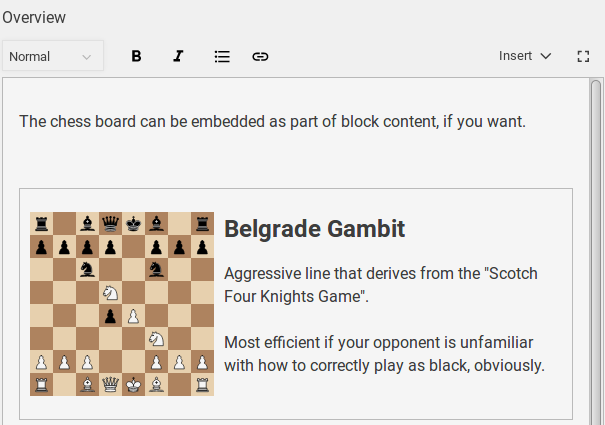

# plugin-template-chess-input

Plugin template for input component modelling a chess board, including preview

## Main take-aways

* Schema types can implement a _part_ to be automatically loaded (`part:@sanity/base/schema-type`)
* Schema types can define a default input and preview component
* Schema types should always be built with the data model and querying concerns in mind. It should _not_ be determined based on how a specific input component takes it's input.
* Preview components has different contexts based on where they are rendered. They might appear in a list or inside the block content editor, for instance. Make sure it works in different contexts, or defer to the default preview component.
* When the value of an input changes, create and emit fine-grained patches. This ensures it works well in a real-time setting.
* Never assume the local state is the same as the remote state. Include `setIfMissing`-patches for parent paths - `_type` is often forgotten, but needs to be included at the root of an object. When inserting to an array, emit a `setIfMissing` patch that initializes the path to an empty array first.

## Usage

`sanity init plugin https://github.com/sanity-io/plugin-template-chess-input/archive/master.zip`

## License

MIT-licensed. See LICENSE.
